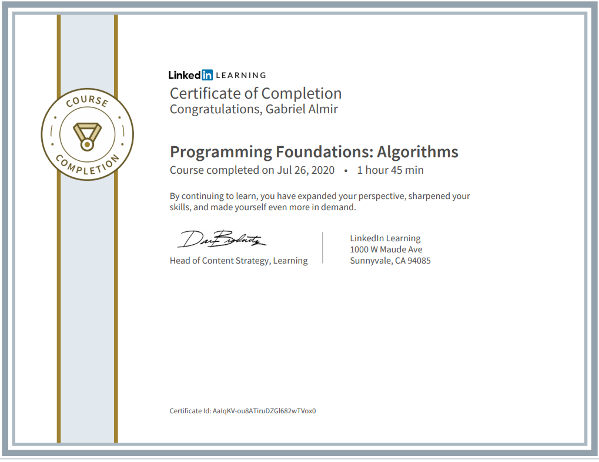

# Programming Foundations: Algorithms

Exercises done following along the [Programming Foundations: Algorithms Course on LinkedIn](https://www.linkedin.com/learning/programming-foundations-algorithms/).

<!--  -->

Lessons coved:
  - BigO notations
  - Data Structures
  - Recursions
  - Sort, Search, Filter, Find Max, Count algorithms
